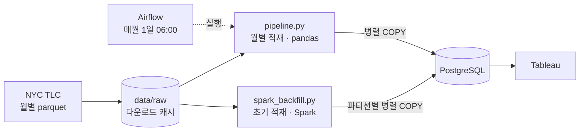

Readme · MD


# 뉴욕 택시 운행 기록을 사용한 택시 운전 기사 수익 최적화 대시보드

## 1. 프로젝트 개요

본 프로젝트는 오픈 데이터셋인 월별 뉴욕 택시 운행 데이터(NYC Yellow Taxi)를 대상으로 ETL 파이프라인을 설계·구축하고, 더 나아가 데이터의 수집·정제·적재를 자동화하고 적재한 데이터를 활용해 택시 운전 기사의 수익을 최적화한 대시보드를 구성하는 것을 목표로 한다.

### 1.1 프로젝트 목표

- NYC TLC 공개 데이터를 자동으로 수집하고 정제해 로컬 PostgreSQL에 적재하는 파이프라인 구축
- Airflow를 활용한 월별 자동화 스케줄 설정
- 새 환경에서 과거 데이터를 한 번에 채우는 Spark 초기 적재(backfill) 구성
- Tableau를 통한 대시보드 시각화
- 모니터링 및 데이터 품질 검사 체계 구성

### 1.2 사용 데이터

**NYC TLC (Taxi & Limousine Commission) Yellow Taxi Trip Records**

- 출처: https://www.nyc.gov/site/tlc/about/tlc-trip-record-data.page
- 형식: Parquet 파일 (월별 제공)
- 규모: 2024년 1월 기준 원본 약 296만 행, 정제 후 약 271만 행
- 주요 컬럼: 승하차 시간, 요금, 팁, 운행 거리, 승객 수 등

## 2. 시스템 아키텍처


데이터 규모에 따라 처리 경로를 둘로 나눴다.

| 경로                 | 언제                         | 데이터 양          | 처리                                                             |
| -------------------- | ---------------------------- | ------------------ | ---------------------------------------------------------------- |
| 월별 적재            | 매월 1일 (Airflow)           | 한 달, 약 270만 행 | `pipeline.py` — pandas + pyarrow + 병렬 COPY                     |
| 초기 적재 (backfill) | 새 환경을 처음 만들 때 한 번 | 여러 달~여러 해    | `spark_backfill.py` — Spark로 한꺼번에 정제 + 파티션별 병렬 COPY |



- **오케스트레이션**: Apache Airflow — 월별 자동 실행 스케줄 관리
- **데이터 수집**: Python `urllib` 라이브러리를 통해 NYC TLC에서 parquet 파일 형식으로 다운로드
- **데이터 정제**: Python `Pandas` 라이브러리를 통해 이상값 제거, 파생 칼럼 생성 (초기 적재는 같은 규칙을 Apache Spark로 처리)
- **데이터 적재**: PostgreSQL `COPY`로 정제 결과를 적재 (DB 연결 여러 개로 병렬 적재, CSV 변환은 `pyarrow`)
- **실행 환경**: Docker Compose (PostgreSQL + 월별 파이프라인 + 초기 적재), 접속 정보와 성능 설정은 `.env`로 관리
- **시각화**: Tableau Desktop을 이용해 BI 대시보드 구성
- **버전 관리**: Git을 통한 코드 및 Tableau 워크북 관리

## 3. ETL 파이프라인 상세

### 3.1 Extract (추출)

NYC TLC 공식 사이트에서 월별 parquet 파일을 다운로드한다. 이미 로컬에 존재하는 파일은 건너뛰며, 사이트에 아직 공개되지 않은 달은 다운로드 요청이 거절되므로 에러 없이 건너뛴다.

- 다운로드 경로: `data/raw/yellow_tripdata_YYYY-MM.parquet`
- 중복 다운로드 방지: 파일 존재 여부 사전 확인. 임시 파일(`.part`)로 받은 뒤 완료되면 이름을 바꿔, 중간에 끊긴 파일이 캐시로 남지 않게 함
- 필요한 컬럼만 읽기: 원본 19개 컬럼 중 분석에 쓰는 8개만 읽어 메모리 사용량을 줄임
- 미공개 파일 처리: HTTP 403/404 응답이면 경고 로그 후 건너뜀 (NYC TLC 데이터가 2~3개월의 공개 딜레이가 있기 때문)

### 3.2 Transform (정제)

Pandas 라이브러리를 활용해 원본 데이터의 이상값을 제거하고 분석에 필요한 파생 칼럼을 생성한다.

**이상값 제거 기준**

| 정제 항목 | 조건                                      | 비고                                               |
| --------- | ----------------------------------------- | -------------------------------------------------- |
| 운행 거리 | `df["trip_distance"] > 0`                 | 운행 거리 0 이하 제거                              |
| 기본 요금 | `df["fare_amount"] > 0`                   | 음수 또는 0 요금 제거                              |
| 전체 요금 | `df["total_amount"] > 0`                  | 전체 금액 오류 제거                                |
| 승객 수   | `df["passenger_count"].between(1, 6)`     | 택시 법적 최대 탑승 인원 기준                      |
| 운행 시간 | `df["trip_duration_min"].between(1, 180)` | 1분 미만은 오류, 3시간 초과는 비정상 운행으로 간주 |
| 날짜 필터 | 처리하는 연·월에 해당하는 운행만 유지     | 월별 파일에 섞인 다른 달 데이터 제거               |

**파생 칼럼 생성**

| 파생 칼럼           | 계산 방식                                                                                 | 활용 목적          |
| ------------------- | ----------------------------------------------------------------------------------------- | ------------------ |
| `trip_duration_min` | `(tpep_dropoff_datetime - tpep_pickup_datetime).dt.total_seconds() / 60` (소수 둘째 자리) | 운행 시간 분석     |
| `pickup_hour`       | `tpep_pickup_datetime.dt.hour`                                                            | 시간대별 패턴 분석 |
| `pickup_weekday`    | `tpep_pickup_datetime.dt.day_name()`                                                      | 요일별 패턴 분석   |
| `tip_rate`          | `tip_amount / fare_amount` (소수 넷째 자리)                                               | 팁 비율 분석       |

### 3.3 데이터 적재

정제된 데이터를 PostgreSQL `COPY`로 적재한다. 같은 월을 다시 실행하면 해당 월을 먼저 지우고 넣으므로 중복이 생기지 않는다.

- **COPY 적재**: SQL `INSERT` 대신 PostgreSQL의 대량 적재 명령 `COPY`로 CSV 데이터를 그대로 흘려보낸다
- **Arrow CSV 변환**: COPY에 넣을 CSV를 `pandas.to_csv` 대신 `pyarrow.csv`(C++)로 만든다
- **병렬 COPY**: DB 연결을 여러 개 열어 20만 행 단위로 나눠 동시에 적재한다 (`.env`의 `COPY_WORKERS`)
- **인덱스 지연 생성**: 적재량이 테이블의 20% 이상이면 인덱스를 지웠다가 적재 후 한 번에 만든다. 큰 테이블에 소량을 추가할 때는 오히려 느려지므로 자동으로 건너뛴다
- **실패 처리**: 연결마다 따로 커밋하므로, 적재 중 실패하면 해당 월 데이터를 지워 일부만 들어간 상태를 남기지 않는다

### 3.4 성능 개선

기존 파이프라인(`to_sql` multi INSERT)은 2024년 1월 데이터(약 271만 행)를 적재하는 데 5분 넘게 걸렸다. 단계별로 시간을 측정해 병목을 찾고, 기법을 하나씩 적용하며 효과를 확인했다.

| 단계 | 적용 기법                                           | 총 시간   | 기존 대비      |
| ---- | --------------------------------------------------- | --------- | -------------- |
| 기존 | 다운로드 캐싱 + `to_sql` multi INSERT (5만 행 단위) | 325.1초   | -              |
| ①    | + 필요한 컬럼만 읽기, `COPY` 적재                   | 17.6초    | 94.6% 감소     |
| ②    | + Arrow CSV 변환                                    | 11.4초    | 96.5% 감소     |
| ③    | + 병렬 COPY (DB 연결 8개)                           | 6.8초     | 97.9% 감소     |
| ④    | + 인덱스 지연 생성                                  | **5.6초** | **98.3% 감소** |

- 측정 환경: 28코어 Windows PC, Docker Desktop, PostgreSQL 16 (대량 적재 설정 적용), 모든 단계에서 적재 행 수 2,713,464행으로 동일
- 최대 메모리 사용량: 2,895MB → 1,349MB
- DB 연결을 16개로 늘리면 같은 데이터가 3.7초에 적재되었다
  **병목 분석 요약**

- 기존 방식에서 시간의 대부분은 DB가 아니라 파이썬 쪽에 있었다. 5만 행 × 12컬럼, 약 60만 개의 값이 들어간 `INSERT` 문을 SQLAlchemy가 조립하는 데 대부분의 시간이 쓰였다 (프로파일링 결과: 5만 행 적재 19초 중 실제 DB 실행은 2.3초).
- COPY로 바꾼 뒤에는 CSV 변환(`pandas.to_csv`)이 적재 시간의 절반을 차지했다. `pyarrow`로 바꾸자 변환 시간이 15.9초에서 2.5초로 줄었다.
- 남은 병목은 CPU를 하나만 쓰는 구조였다. PostgreSQL은 연결 하나를 프로세스 하나로 처리하므로, 연결을 여러 개로 나눠 여러 코어가 동시에 받도록 했다. `pyarrow`는 변환 중 파이썬 GIL을 풀어 주기 때문에 스레드 여러 개가 실제로 동시에 변환할 수 있다.
- PostgreSQL 설정(`sql/pg_bulk_load.sql`)은 CSV 변환이 병목일 때는 효과가 없었고, 그 병목을 없앤 뒤에야 약 20%의 추가 개선이 나타났다.
  측정 도구와 실험 과정 전체(Spark, Kafka 실험 포함)는 [`local-bottleneck-lab`](https://github.com/nyongnyam/NYC_Taxi/tree/local-bottleneck-lab) 브랜치의 `docs/BOTTLENECKS.md`에 정리했다.

### 3.5 초기 적재 (Spark backfill)

새 환경을 처음 만들 때는 과거 데이터를 여러 달~여러 해 치 한꺼번에 채워야 한다. `pipeline.py`는 요청한 달을 모두 pandas DataFrame 하나로 메모리에 올리므로, 기간이 길어지면 메모리가 부족해진다. 병목 실험에서 6개월 치를 메모리 4GB로 제한해 처리했을 때 pandas는 메모리 부족으로 실패했고, Spark는 106.4초에 처리했다. 그래서 초기 적재만 Spark(`spark_backfill.py`)로 분리했다.

1. **다운로드**: 기간 안의 달을 스레드로 동시에 받는다. 다운로드는 계산이 아니라 네트워크 작업이므로 Spark를 쓰지 않는다. 공개되지 않은 달은 건너뛴다 (`pipeline.download` 재사용)
2. **읽기·정제**: Spark가 모든 parquet을 읽어 필요한 컬럼만 같은 타입으로 맞추고, 3.2와 같은 규칙으로 정제한다. 데이터를 파티션 단위로 흘려보내므로 기간이 길어져도 메모리 사용량이 크게 늘지 않는다
3. **삭제**: 기간 안의 기존 데이터를 지운다 (다시 실행해도 중복되지 않음)
4. **적재**: Spark 파티션마다 DB 연결을 열어 COPY를 병렬로 보낸다. CSV 변환은 `mapInArrow`로 받은 Arrow 배치를 `pyarrow`로 바로 바꾼다. 적재량이 테이블의 20% 이상이면 인덱스를 지웠다가 마지막에 한 번에 만든다

- 코어는 기본적으로 최대 4개만 쓴다 (`SPARK_LOCAL_CORES`). 실험에서 28코어 PC가 모든 코어(`local[*]`)를 쓰자 코어마다 뜬 파이썬 워커 때문에 메모리 한도를 넘겼다
- 2011년 이후 파일만 같은 형식이다. 컬럼 이름이 다른 2009~2010년 파일은 건너뛴다
- 한 달 단위 적재는 Spark 실행 준비(JVM 기동, 작업 분배) 비용 때문에 pandas 쪽이 빠르므로, 매월 적재는 그대로 `pipeline.py`를 쓴다

## 4. Airflow 자동화

매월 1일 오전 6시에 DAG(Directed Acyclic Graph)를 자동으로 실행해 데이터 수집부터 품질 검사까지의 전체 흐름을 순서대로 관리한다.

### 4.1 DAG 구성

1. **extract** — 지난달 parquet 파일 다운로드 (`data/raw/`에 캐시, 아직 공개되지 않은 달이면 건너뜀)
2. **transform_and_load** — 정제 및 PostgreSQL에 적재, `pipeline_runs`에 이력 기록
3. **quality_check** — 행 수 확인, 이상 요금 감지

### 4.2 스케줄

- 스케줄: `0 6 1 * *` (매월 1일 오전 6시)
- 대상 월: 실행 기준 시각(`logical_date`)의 지난달 데이터를 수집
- 실행 환경: `airflow standalone` — 웹 서버 + 스케줄러를 단일 명령으로 통합 실행

## 5. 데이터베이스 구조

### 5.1 주요 테이블

`clean_taxi_trips` 테이블 위에 여러 분석 뷰를 생성했다.

| 테이블/뷰            | 유형   | 설명                                                                                                                                   |
| -------------------- | ------ | -------------------------------------------------------------------------------------------------------------------------------------- |
| `clean_taxi_trips`   | 테이블 | 정제된 택시 운행 데이터 (핵심 테이블)                                                                                                  |
| `pipeline_runs`      | 테이블 | 파이프라인 실행 이력 (성공/실패, 소요 시간)                                                                                            |
| `v_hourly_stats`     | 뷰     | 월 × 시간대 × 요일별 운행량, 평균 요금, 평균 운행 시간, 팁 비율, 총 매출 (Tableau에서 `month`, `pickup_weekday`로 다른 뷰와 관계 설정) |
| `v_weekday_stats`    | 뷰     | 요일별 운행량, 평균 요금, 팁 비율 (`pickup_weekday` 기준)                                                                              |
| `v_monthly_trend`    | 뷰     | 월별 운행량, 평균 요금, 총 매출 (`DATE_TRUNC` 기준)                                                                                    |
| `v_driver_revenue`   | 뷰     | 운행 시간 대비 수익을 시간대와 요일 조합으로 집계                                                                                      |
| `v_distance_revenue` | 뷰     | 운행 거리를 0.1마일 단위로 묶어 거리별 평균 수익, 팁 비율, 시간당 수익을 비교                                                          |

### 5.2 ERD 다이어그램


## 6. Tableau 시각화

### 6.1 황금 시간대 히트맵


**인사이트**

- 평균 수익: 월요일이 최고, 토요일이 최저 — 월요일 평균 수익($32)이 토요일 평균 수익($27.5)보다 약 16% 높음
- 토요일은 건당 수익은 낮지만 팁 비율이 가장 높음
  **도출 결론**

- 높은 건당 수익을 원하는 경우: 월요일 - 화요일 운행
- 높은 팁을 원하는 경우: 금요일 - 토요일 야간 운행

### 6.2 요일별 시간당 수익


**인사이트**

- 모든 요일에서 새벽 5시가 시간당 수익 피크, 특히 일요일($155)과 월요일($148)이 가장 높음
- 오전 6시 이후 수익이 급격히 하락해 오전 9-10시에 최저점을 기록함
- 오후 19~20시경에 2차 피크가 나타남
  **도출 결론**

- 일주일 중 일요일 새벽이 전체 최고 수익 구간
- 평일의 경우 19~20시가 가장 높은 수익을 기록하는 구간
- 낮 시간 동안 가장 높은 수익을 기록하는 요일은 토요일
- 새벽 운행에 집중하고, 오전 9시-11시 동안은 운행을 중단하는 것이 효율적

### 6.3 시간대별 팁 비율 vs 운행량


**인사이트**

- 운행량은 오후 18시가 최고(8.4M건)이고 팁 비율도 0.23으로 함께 높음
- 새벽 4~5시는 운행량 최저(0.5M건)이지만 팁 비율은 0.18로 낮음
- 오전 6시 팁 비율이 0.18로 하루 중 최저
- 오후로 갈수록 팁 비율이 꾸준히 상승
  **도출 결론**

운행량과 팁 비율이 동시에 높은 17-19시가 가장 균형 잡혀있다. 새벽은 팁은 낮아도 기본 요금이 높은 반면, 오후는 팁으로 수익을 보완하는 구조다.

- 높은 팁을 원하는 경우: 오후 17-19시 운행
- 기본 요금을 중시하는 경우: 새벽 4-6시 운행

### 6.4 요일별 평균 수익 비교


**인사이트**

- 월요일($32)이 건당 평균 수익 1위, 토요일($27.5)이 최하위
- 팁 비율은 반대로 토요일(0.22)이 가장 높고 일요일(0.20)이 가장 낮음
- 수익과 팁 비율이 역상관 관계: 건당 수익이 높은 요일일수록 팁 비율이 낮음
- 주중(월-목) 건당 수익이 주말보다 평균 10~15% 높음
  **도출 결론**

- 주중은 장거리/업무 목적 운행이 많은 것으로 보여 건당 수익이 높음
- 주말은 단거리/유흥 목적 운행이 많아 건당 수익은 낮지만 팁 비율이 높음
- 최대 수익을 원하는 경우: 월-화 주중 운행
- 팁 수입을 극대화하고 싶은 경우: 금-토 야간 운행

### 6.5 월별 수익률 증감


**인사이트**

- 2024년 9월 +18.31%, 2024년 11월 +8.10% — 연말로 갈수록 수익이 증가하는 계절성이 있음
- 2024년 1월(-33.48%)은 연초 수요 감소로 큰 폭 하락
- 2025년 하반기는 등락을 반복하며 2024년 수준의 약 60%로 유지됨
  **도출 결론**

연말에 수익이 집중되고, 연초에는 수요가 낮아 수익이 떨어지는 계절성이 뚜렷하다. 연간 수익을 극대화하기 위해선 10-12월 운행 시간을 늘리고 1-2월은 비용을 절감해야 한다.

## 7. 결론

### 7.1 시간대 전략

- 최우선적으로 시간당 수익이 최고($148-155)를 기록하는 새벽 4-6시 운행
- 운행량 + 팁이 최고를 기록하는 오후 17-19시 운행
- 시간당 수익이 최저를 기록하는 오전 9-11시 운행은 피할 것

### 7.2 요일 전략

- 건당 수익을 극대화: 월-화 주중 운행 (평균 $30-32)
- 팁 수익 극대화: 금-토 야간 운행 (팁 비율 0.21-0.22)

### 7.3 계절 전략

- 집중 운행: 10-12월의 연말 시즌 (수익 증가율 최고)
- 비용 절감: 1-2월 연초 비수기

## 8. 실행 방법

### Docker Compose

```bash
cp .env.example .env                              # Windows: copy .env.example .env
docker compose up -d db                           # PostgreSQL 기동 (처음 뜰 때 sql/setup.sql 자동 실행)
docker compose run --rm pipeline --year 2024 --months 1   # 한 달 적재 (옵션 없이 실행하면 2024년 1월)
docker compose run --rm pipeline --year 2024 --months 1-3 # 같은 해의 여러 달
```

새 환경에서 과거 데이터를 한 번에 채울 때 (Spark 초기 적재):

```bash
docker compose run --rm backfill                                # 2024-01부터 이번 달까지 공개된 모든 달
docker compose run --rm backfill --from 2024-01 --to 2024-12    # 기간 지정
docker compose run --rm backfill --master "local[8]"            # 코어 8개 사용 (기본 최대 4개)
```

기간을 길게 잡으면 다운로드와 DB 용량이 크게 늘어난다 (2011~2015년은 한 해에 1억 6천만 행 이상). 실행 전에 디스크 여유 공간을 확인한다.

대량 적재용 PostgreSQL 설정 (선택):

```bash
docker compose exec -T db psql -U postgres -d nyctaxi < sql/pg_bulk_load.sql
docker compose restart db
```

`synchronous_commit=off` 등 속도를 우선한 설정이라, 갑자기 전원이 꺼지면 마지막 몇 초 분량의 커밋이 사라질 수 있다. 되돌릴 때는 `sql/pg_reset.sql`을 같은 방법으로 실행한다.

### 로컬 Python

```bash
python -m venv .venv && source .venv/bin/activate   # Windows: .venv\Scripts\activate
pip install -r requirements.txt
cp .env.example .env                                # DB 접속 정보 수정
psql -U postgres -d nyctaxi -f sql/setup.sql
python pipeline.py --year 2024 --months 1
python spark_backfill.py                 # 초기 적재: 2024-01부터 공개된 모든 달 (Java 17 필요)
python monitoring/health_check.py
```

### 설정 (`.env`)

| 이름                  | 기본값                    | 설명                                                                        |
| --------------------- | ------------------------- | --------------------------------------------------------------------------- |
| `COPY_WORKERS`        | 0 (자동: 코어 수, 최대 8) | 동시에 COPY할 DB 연결 수                                                    |
| `DEFER_INDEXES`       | auto                      | 인덱스 지연 생성 (auto: 적재량이 테이블의 20% 이상일 때만 / on / off)       |
| `COPY_CHUNK_ROWS`     | 200000                    | 연결 하나가 한 번에 보내는 행 수                                            |
| `SPARK_LOCAL_CORES`   | 4                         | 초기 적재 때 Spark가 동시에 쓰는 코어 수                                    |
| `SPARK_DRIVER_MEMORY` | auto                      | 초기 적재 때 Spark 메모리 (auto: 코어당 약 512MB, 시스템 메모리의 40% 이하) |

### Airflow

`dags/nyc_taxi_dag.py`를 `~/airflow/dags/`에 심볼릭 링크로 연결한다. 프로젝트 경로가 다르면 `NYC_TAXI_PROJECT_DIR` 환경 변수로 지정한다. Airflow 2.x와 3.x에서 동작한다.
