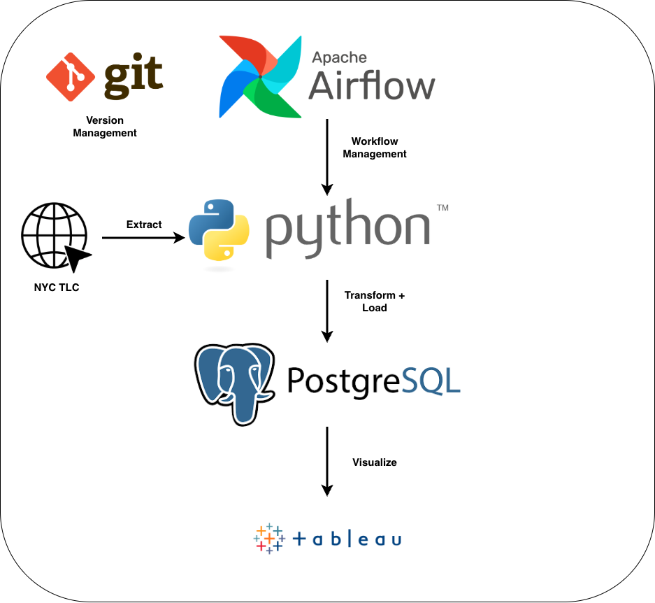
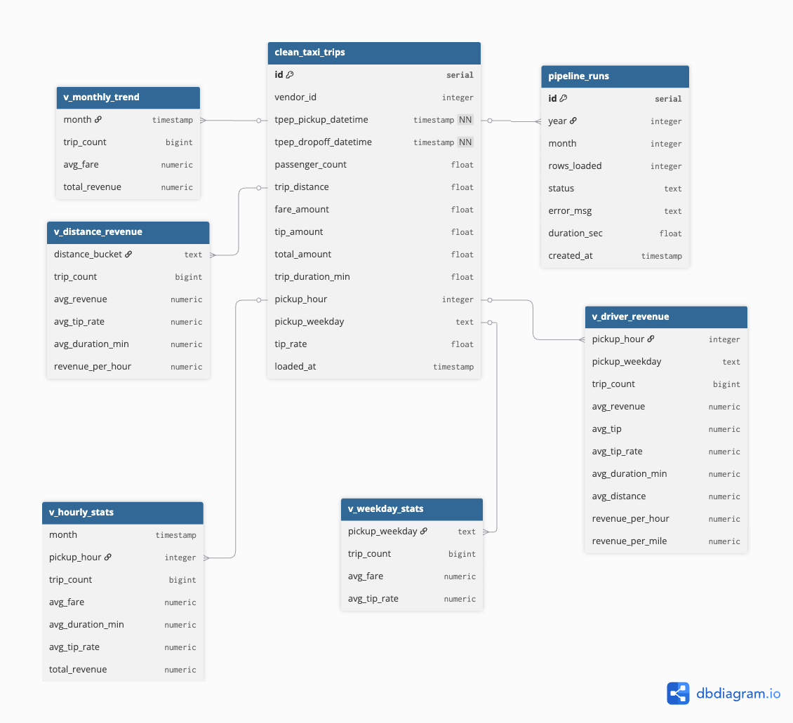
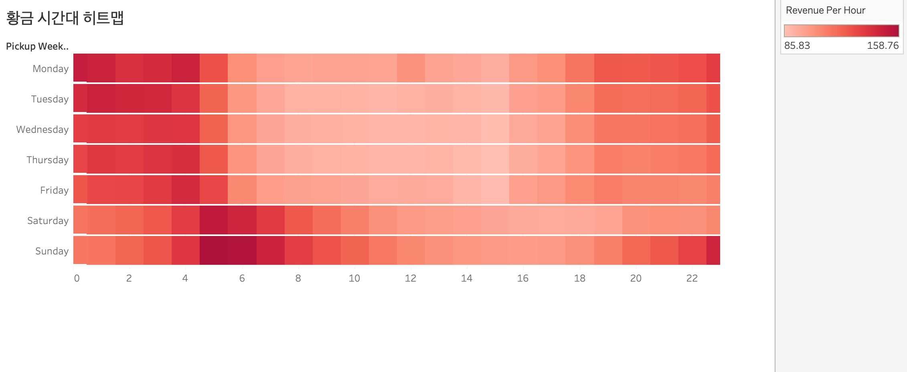
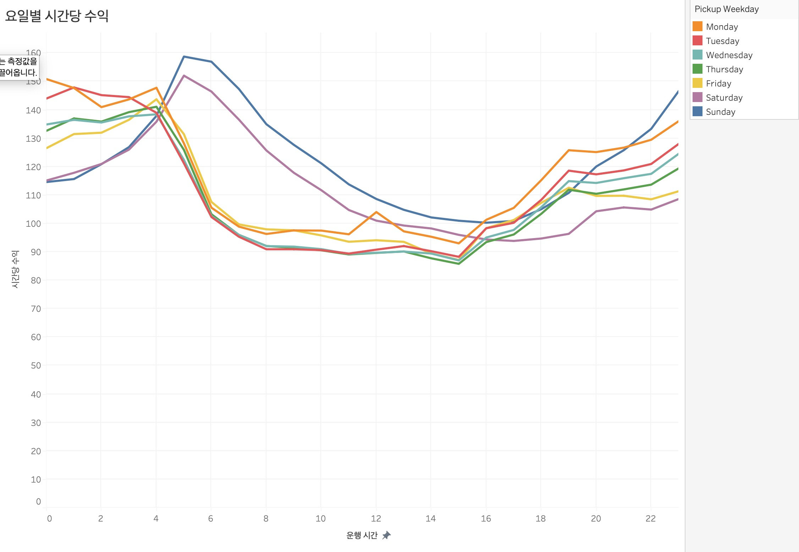
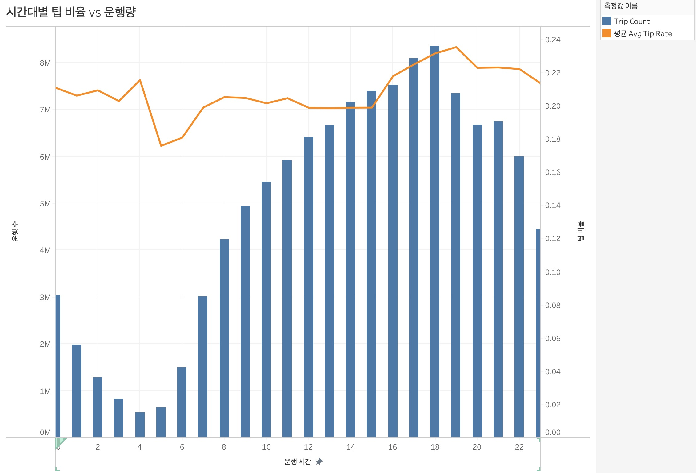
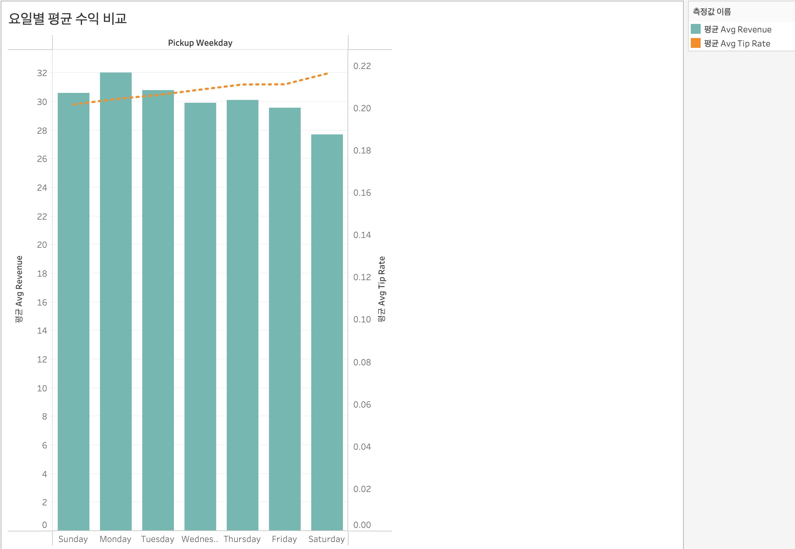
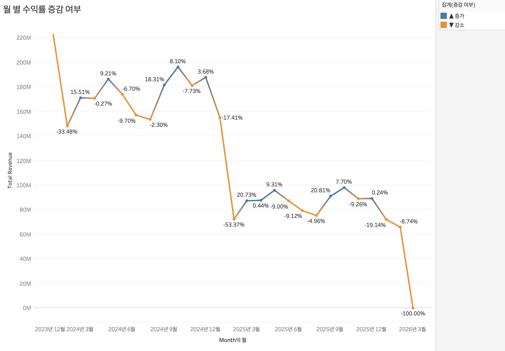

# 뉴욕 택시 운행 기록을 사용한 택시 운전 기사 수익 최적화 대시보드

## 1. 프로젝트 개요

본 프로젝트는 오픈 데이터셋인 월별 뉴욕 택시 운행 데이터(NYC Yellow Taxi)를 대상으로 ETL 파이프라인을 설계·구축하고, 더 나아가 데이터의 수집·정제·적재를 자동화하고 적재한 데이터를 활용해 택시 운전 기사의 수익을 최적화한 대시보드를 구성하는 것을 목표로 한다.

### 1.1 프로젝트 목표

- NYC TLC 공개 데이터를 자동으로 수집하고 정제해 로컬 PostgreSQL에 적재하는 파이프라인 구축
- Airflow를 활용한 월별 자동화 스케줄 설정
- Tableau를 통한 대시보드 시각화
- 모니터링 및 데이터 품질 검사 체계 구성

### 1.2 사용 데이터

**NYC TLC (Taxi & Limousine Commission) Yellow Taxi Trip Records**

- 출처: https://www.nyc.gov/site/tlc/about/tlc-trip-record-data.page
- 형식: Parquet 파일 (월별 제공)
- 규모: 월 약 270만 행 (2024년 1월 기준)
- 주요 컬럼: 승하차 시간, 요금, 팁, 운행 거리, 승객 수 등

## 2. 시스템 아키텍처

- **오케스트레이션**: Apache Airflow — 월별 자동 실행 스케줄 관리
- **데이터 수집**: Python `urllib` 라이브러리를 통해 NYC TLC에서 parquet 파일 형식으로 다운로드
- **데이터 정제**: Python `Pandas` 라이브러리를 통해 이상값 제거, 파생 칼럼 생성
- **데이터 적재**: Python `SQLAlchemy` 라이브러리를 활용해 정제 결과를 로컬 PostgreSQL에 적재
- **시각화**: Tableau Desktop을 이용해 BI 대시보드 구성
- **버전 관리**: Git을 통한 코드 및 Tableau 워크북 관리

## 3. ETL 파이프라인 상세

### 3.1 Extract (추출)

NYC TLC 공식 사이트에서 월별 parquet 파일을 다운로드한다. 이미 로컬에 존재하는 파일은 건너뛰며, 사이트에 아직 공개되지 않은 파일은 HTTP HEAD 요청으로 사전 확인 후 에러 없이 건너뛴다.

- 다운로드 경로: `data/raw/yellow_tripdata_YYYY-MM.parquet`
- 중복 다운로드 방지: 파일 존재 여부 사전 확인
- 미공개 파일 처리: HTTP 403 에러 시 경고 로그 후 건너뜀 (NYC TLC 데이터가 2~3개월의 공개 딜레이가 있기 때문)

### 3.2 Transform (정제)

Pandas 라이브러리를 활용해 원본 데이터의 이상값을 제거하고 분석에 필요한 파생 칼럼을 생성한다.

**이상값 제거 기준**

| 정제 항목 | 조건 | 비고 |
|---|---|---|
| 운행 거리 | `df["trip_distance"] > 0` | 운행 거리 0 이하 제거 |
| 기본 요금 | `df["fare_amount"] > 0` | 음수 또는 0 요금 제거 |
| 전체 요금 | `df["total_amount"] > 0` | 전체 금액 오류 제거 |
| 승객 수 | `df["passenger_count"].between(1, 6)` | 택시 법적 최대 탑승 인원 기준 |
| 운행 시간 | `df["trip_duration_min"].between(1, 180)` | 1분 미만은 오류, 3시간 초과는 비정상 운행으로 간주 |
| 날짜 필터 | `df["tpep_pickup_datetime"].dt.year >= 2024` | 다른 달 데이터 혼입 방지 |

**파생 칼럼 생성**

| 파생 칼럼 | 계산 방식 | 활용 목적 |
|---|---|---|
| `trip_duration_min` | `(tpep_dropoff_datetime - tpep_pickup_datetime).seconds / 60` | 운행 시간 분석 |
| `pickup_hour` | `tpep_pickup_datetime.dt.hour` | 시간대별 패턴 분석 |
| `pickup_weekday` | `tpep_pickup_datetime.dt.day_name()` | 요일별 패턴 분석 |
| `tip_rate` | `tip_amount / fare_amount` | 팁 비율 분석 |

### 3.3 데이터 적재

정제된 DataFrame을 SQLAlchemy의 `to_sql()` 메서드를 통해 로컬 PostgreSQL에 적재한다.

- `append` 방식을 사용해 기존 데이터를 유지하며 새 데이터 추가
- `chunksize`: 50000
- 연결 방식: `postgresql://username@localhost:5432/nyctaxi`

## 4. Airflow 자동화

매월 1일 오전 6시에 DAG(Directed Acyclic Graph)를 자동으로 실행해 데이터 수집부터 품질 검사까지의 전체 흐름을 순서대로 관리한다.

### 4.1 DAG 구성

1. **extract** — 전달 parquet 파일 다운로드 후 `/tmp/`에 임시 저장
2. **transform_and_load** — 정제 및 PostgreSQL에 적재, `pipeline_runs`에 이력 기록
3. **quality_check** — 행 수 확인, 이상 요금 감지

### 4.2 스케줄

- 스케줄: `0 6 1 * *` (매월 1일 오전 6시)
- 전달 데이터 자동 수집: `datetime.now() - relativedelta(months=1)`
- 실행 환경: `airflow standalone` — 웹 서버 + 스케줄러를 단일 명령으로 통합 실행

## 5. 데이터베이스 구조

### 5.1 주요 테이블

`clean_taxi_trips` 테이블 위에 여러 분석 뷰를 생성했다.

| 테이블/뷰 | 유형 | 설명 |
|---|---|---|
| `clean_taxi_trips` | 테이블 | 정제된 택시 운행 데이터 (핵심 테이블) |
| `pipeline_runs` | 테이블 | 파이프라인 실행 이력 (성공/실패, 소요 시간) |
| `v_hourly_stats` | 뷰 | 시간대별 운행량, 평균 요금, 평균 운행 시간, 팁 비율, 총 매출 (`pickup_hour` 기준, 0~23시) |
| `v_weekday_stats` | 뷰 | 요일별 운행량, 평균 요금, 팁 비율 (`pickup_weekday` 기준) |
| `v_monthly_trend` | 뷰 | 월별 운행량, 평균 요금, 총 매출 (`DATE_TRUNC` 기준) |
| `v_driver_revenue` | 뷰 | 운행 시간 대비 수익을 시간대와 요일 조합으로 집계 |
| `v_distance_revenue` | 뷰 | 운행 거리를 5개 구간으로 나누어 구간별 시간당 수익을 비교 |

### 5.2 ERD 다이어그램

## 6. Tableau 시각화

### 6.1 황금 시간대 히트맵

**인사이트**

- 평균 수익: 월요일이 최고, 토요일이 최저 — 월요일 평균 수익($32)이 토요일 평균 수익($27.5)보다 약 16% 높음
- 토요일은 건당 수익은 낮지만 팁 비율이 가장 높음

**도출 결론**

- 높은 건당 수익을 원하는 경우: 월요일 ~ 화요일 운행
- 높은 팁을 원하는 경우: 금요일 ~ 토요일 야간 운행

### 6.2 요일별 시간당 수익

**인사이트**

- 모든 요일에서 새벽 5시가 시간당 수익 피크, 특히 일요일($155)과 월요일($148)이 가장 높음
- 오전 6시 이후 수익이 급격히 하락해 오전 9~10시에 최저점을 기록함
- 오후 19~20시경에 2차 피크가 나타남

**도출 결론**

- 일주일 중 일요일 새벽이 전체 최고 수익 구간
- 평일의 경우 19~20시가 가장 높은 수익을 기록하는 구간
- 낮 시간 동안 가장 높은 수익을 기록하는 요일은 토요일
- 새벽 운행에 집중하고, 오전 9시~11시 동안은 운행을 중단하는 것이 효율적

### 6.3 시간대별 팁 비율 vs 운행량

**인사이트**

- 운행량은 오후 18시가 최고(8.4M건)이고 팁 비율도 0.23으로 함께 높음
- 새벽 4~5시는 운행량 최저(0.5M건)이지만 팁 비율은 0.18로 낮음
- 오전 6시 팁 비율이 0.18로 하루 중 최저
- 오후로 갈수록 팁 비율이 꾸준히 상승

**도출 결론**

운행량과 팁 비율이 동시에 높은 17~19시가 가장 균형 잡혀있다. 새벽은 팁은 낮아도 기본 요금이 높은 반면, 오후는 팁으로 수익을 보완하는 구조다.

- 높은 팁을 원하는 경우: 오후 17~19시 운행
- 기본 요금을 중시하는 경우: 새벽 4~6시 운행

### 6.4 요일별 평균 수익 비교

**인사이트**

- 월요일($32)이 건당 평균 수익 1위, 토요일($27.5)이 최하위
- 팁 비율은 반대로 토요일(0.22)이 가장 높고 일요일(0.20)이 가장 낮음
- 수익과 팁 비율이 역상관 관계: 건당 수익이 높은 요일일수록 팁 비율이 낮음
- 주중(월~목) 건당 수익이 주말보다 평균 10~15% 높음

**도출 결론**

- 주중은 장거리/업무 목적 운행이 많은 것으로 보여 건당 수익이 높음
- 주말은 단거리/유흥 목적 운행이 많아 건당 수익은 낮지만 팁 비율이 높음
- 최대 수익을 원하는 경우: 월~화 주중 운행
- 팁 수입을 극대화하고 싶은 경우: 금~토 야간 운행

### 6.5 월별 수익률 증감

**인사이트**

- 2024년 9월 +18.31%, 2024년 11월 +8.10% — 연말로 갈수록 수익이 증가하는 계절성이 있음
- 2024년 1월(-33.48%)은 연초 수요 감소로 큰 폭 하락
- 2025년 하반기는 등락을 반복하며 2024년 수준의 약 60%로 유지됨

**도출 결론**

연말에 수익이 집중되고, 연초에는 수요가 낮아 수익이 떨어지는 계절성이 뚜렷하다. 연간 수익을 극대화하기 위해선 10~12월 운행 시간을 늘리고 1~2월은 비용을 절감해야 한다.

## 7. 결론

### 7.1 시간대 전략

- 최우선적으로 시간당 수익이 최고($148~155)를 기록하는 새벽 4~6시 운행
- 운행량 + 팁이 최고를 기록하는 오후 17~19시 운행
- 시간당 수익이 최저를 기록하는 오전 9~11시 운행은 피할 것

### 7.2 요일 전략

- 건당 수익을 극대화: 월~화 주중 운행 (평균 $30~32)
- 팁 수익 극대화: 금~토 야간 운행 (팁 비율 0.21~0.22)

### 7.3 계절 전략

- 집중 운행: 10~12월의 연말 시즌 (수익 증가율 최고)
- 비용 절감: 1~2월 연초 비수기
